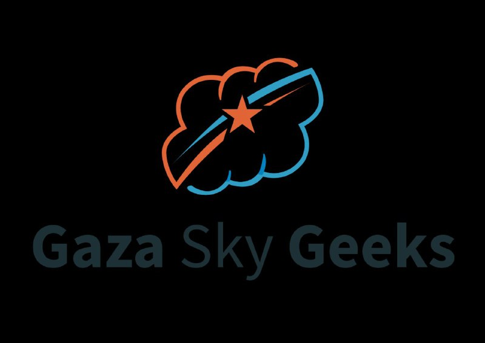

# 🤖 AI & Machine Learning – SkillStack Paths Training (Phase 2)

This repository contains the Artificial Intelligence (AI) and Machine Learning (ML) part of the  
SkillStack Paths training program conducted by Gaza Sky Geeks.  
It includes practical assignments covering search algorithms, logical reasoning, supervised learning,  
and unsupervised learning using Python.

---

## 📁 Folder Structure

All folders are located inside the `AI` directory:

| Folder Name     | Description                                                                 |
|-----------------|-----------------------------------------------------------------------------|
| Assignment1     | A* Search Algorithm implementation with path reconstruction                 |
| Assignment2     | Knowledge representation using propositional logic and model checking       |
| Assignment3     | Supervised learning models (KNN, SVM, Logistic Regression, Decision Tree)   |
| Assignment4     | Unsupervised learning (K-Means clustering) using the Mall Customers dataset |

Additional folder:

| Folder Name | Description                                |
|-------------|--------------------------------------------|
| Basecs      | Basic Python scripts used for testing       |

---

## 🧠 Topics Covered

- A* Search Algorithm  
- Heuristic functions (Manhattan Distance)  
- Logical reasoning and model checking  
- Propositional logic (Implication, KB models, entailment)  
- Supervised learning (classification models)  
- Model evaluation (accuracy, confusion matrix, classification report)  
- Unsupervised learning (K-Means clustering)  
- Elbow Method & Silhouette Score  
- Data preprocessing and feature scaling  

---

## 📊 Datasets Used

- **Iris Dataset** (built-in from scikit-learn)  
- **Mall Customers Dataset** (CSV file included in Assignment4)

---

## 👩‍💻 Author

**Deema Mohammed AL-Maqadma**  
Computer Science Student | GSG Trainee  
Passionate about AI, clean code, and simplifying complex concepts.

---

## 📝 Notes

- All code is written in Python 3.  
- Each assignment folder contains a complete, runnable script.  
- This repository represents the AI & ML phase of the SkillStack Paths training.  
  Other phases (Fundamentals, Data Structures, OOP) are available in separate repositories.
